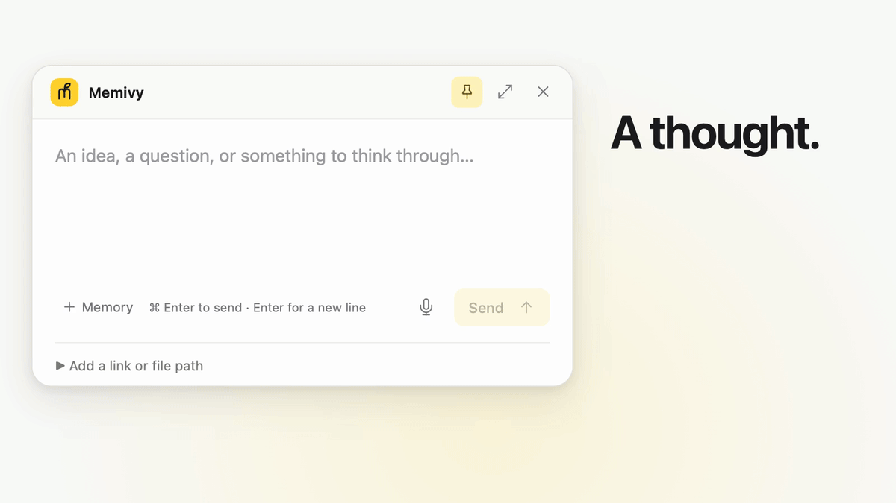
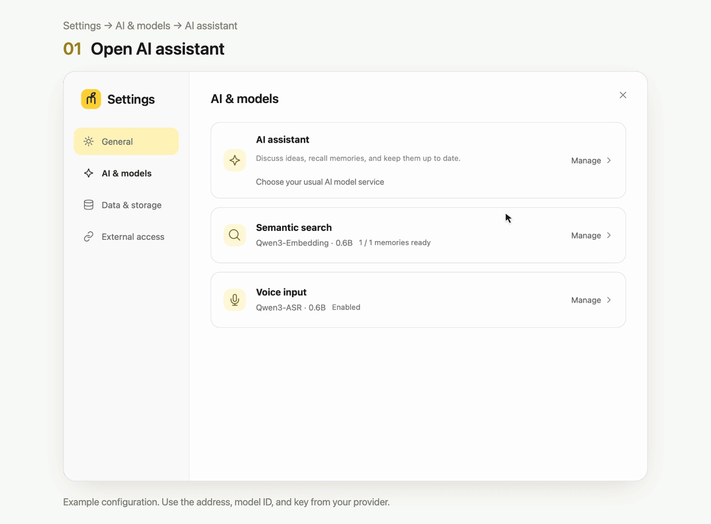
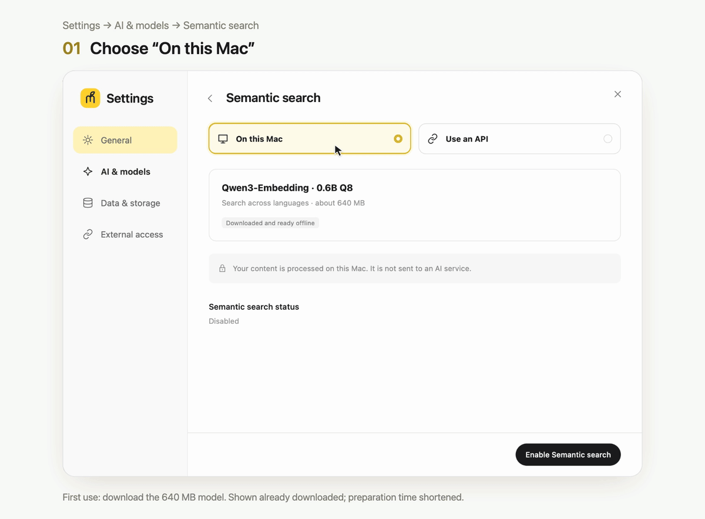
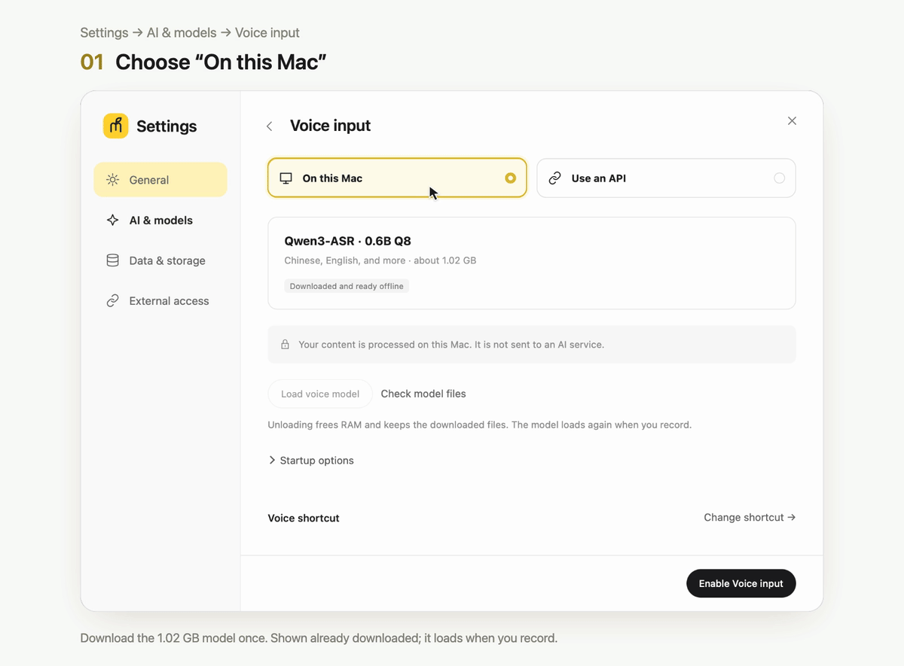
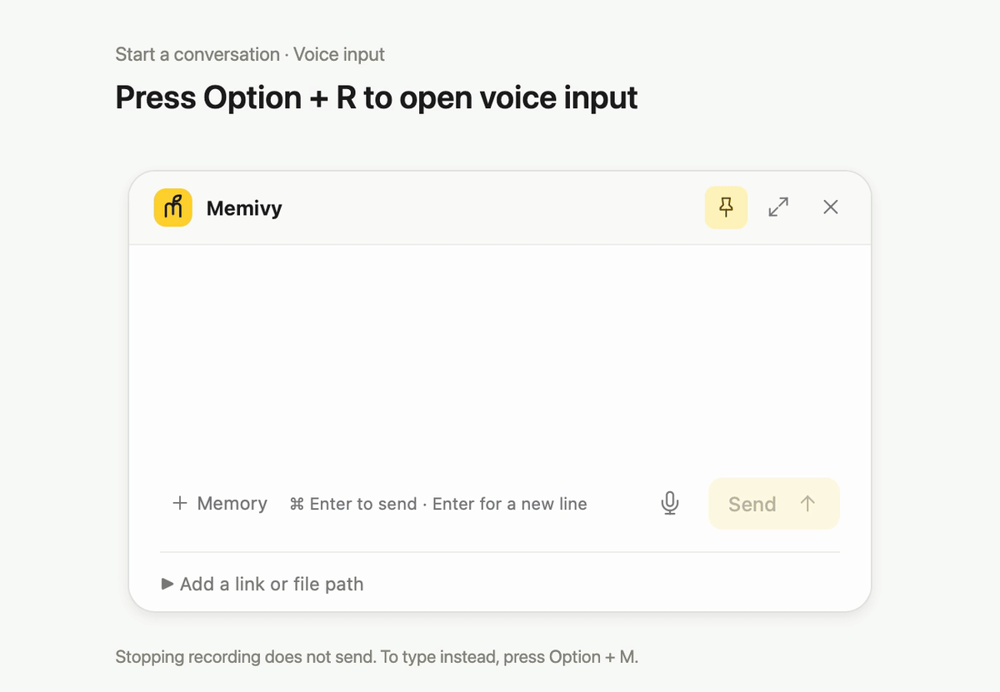
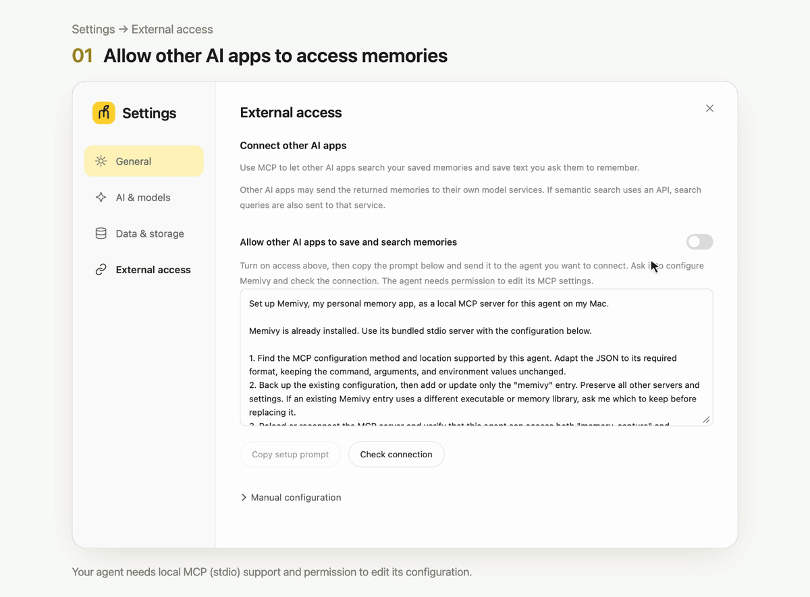

<p align="center">
  <strong>English</strong> · <a href="README.zh-CN.md">简体中文</a>
</p>

<p align="center">
  <a href="https://github.com/boh5/memivy/releases/latest">Download Memivy</a> ·
  <a href="#get-started">Get started</a> ·
  <a href="docs/media/en/memivy.mp4">Watch video</a>
</p>

# Memivy, your personal AI memory assistant

**Capture a thought. Pick up the conversation.**

Press a shortcut and speak or type. Memivy captures your ideas and keeps your memories organized. When you want to revisit something, just ask—or pick up where you left off.

## Features

- **Start with a shortcut**: Speak or type whenever you have an idea to remember.
- **Pick up where you left off**: Memivy draws on your past memories as you talk, remembering new ideas and changes in your thinking.
- **Find memories in your own words**: Describe what you remember to find related thoughts and records, even when you've forgotten the exact wording.
- **Choose your own model (BYOM)**: Connect your preferred AI model service and keep the same memory library when you switch models.
- **Stored on your Mac**: Your memories and conversations are stored on your Mac. No Memivy account is required.
- **Let other AI assistants use your memories**: Through MCP, other AI assistants can save and search memories in Memivy.

## Get started

You need **an Apple Silicon (M-series) Mac running macOS 26 or later**.

### 1. Install

1. Download the latest DMG from [Releases](https://github.com/boh5/memivy/releases/latest).
2. Open the DMG and drag Memivy into Applications.
3. Eject the disk image, then open Memivy from Applications.

Memivy has not been notarized by Apple. If macOS says it cannot verify the developer or check the app for malicious software, open **System Settings → Privacy & Security**, find the message about Memivy, and click **Open Anyway**. Confirm when prompted. See [Apple's instructions](https://support.apple.com/102445) for the system prompts.

<details>
<summary>Verify the download (optional)</summary>

Download the DMG's matching `.sha256` file and put both files in the same folder. Open Terminal, change to that folder, and run:

```sh
shasum -a 256 -c Memivy_*.dmg.sha256
```

A result ending in `OK` means the file passed verification.

</details>

### 2. Set up your AI assistant

Have your provider’s API address, model ID, and API key ready. Choose a model that supports tool calling so Memivy can find and organize your memories.



1. Open **Settings → AI & models → AI assistant**.
2. Follow your provider's instructions to choose the API type: **OpenAI Compatible**, **OpenAI Responses**, **Anthropic**, or **Google Gemini**.
3. Enter the **API address**, **Model ID**, and **API Key** from your provider.
4. Click **Test connection**, then **Save settings** once the test passes.

Your model provider handles API usage and billing.

### 3. Enable local search and voice input

Return to **Settings → AI & models** to enable these local features. Keep Memivy open during the first download. Once downloaded, both features run on your Mac.

#### Semantic search

Find related memories without remembering the exact words. Download the 640 MB model on first use; the demo shows it already downloaded.



1. Open **Semantic search** and choose **On this Mac**.
2. Click **Download and enable**, then **Confirm and start**.
3. Wait for the model download and search preparation to finish.

#### Voice input

Speak your thoughts, then review the text before sending. Download the 1.02 GB model on first use; the demo shows it already downloaded.



1. Open **Voice input** and choose **On this Mac**.
2. Click **Download model** and wait for the download to finish.
3. Click **Enable Voice input**.

### 4. Start a conversation

This demo uses voice input. Allow microphone access when prompted the first time you record.



1. Press the default voice shortcut, **Option+R**, to open the quick window and start recording. Say what's on your mind.
2. Press **Option+R** again to stop recording and wait for transcription to finish.
3. Review the text, then press **Command+Enter** to send it.

To type instead, press **Option+M** to open the quick window. **Enter** adds a new line; **Command+Enter** sends.

To revisit something, press **Option+R** and ask. Describe what you remember; you don't need to find the original conversation first.

## Connect other AI apps

Through MCP, your other AI assistants can save and search memories in Memivy. The other app must support local MCP servers (stdio), and the agent needs permission to edit its configuration.



1. Open **Settings → External access** and turn on **Allow other AI apps to save and search memories**.
2. Click **Copy setup prompt** and send it directly to the agent you want to connect. The prompt already includes the Memivy configuration for this Mac.
3. The prompt asks your agent to add the MCP configuration and check the connection. Follow its instructions if it needs a restart or additional permissions.

You can also expand **Manual configuration** to set up the connection yourself. If you move Memivy later, copy the prompt again and ask your agent to update the configuration.

To stop access, turn off the switch in Memivy's **External access** settings.

## Back up, update, and uninstall

Your library and settings are in `~/Library/Application Support/com.memivy.app/`; downloaded models are in `~/Library/Caches/com.memivy.app/models/`.

<details>
<summary>Back up and restore</summary>

Open **Settings → Data & storage** and click **Create backup**. Backups include memories, conversations, drafts, original inputs, version history, and Trash. They exclude API keys, model settings, downloaded models, and temporary recordings.

To restore, click **Choose backup**, review its contents, and confirm. Memivy backs up the current library first, then replaces it with the selected backup and restarts. Model settings and the MCP switch keep their current values.

</details>

<details>
<summary>Update</summary>

1. Create a backup in **Settings → Data & storage**.
2. Quit Memivy. If other AI apps are connected, disconnect their Memivy MCP connections too.
3. Download the new DMG and replace Memivy in Applications with the new version.
4. Reopen Memivy, check that your memories and drafts are there, then reconnect your other AI apps.

Updates are currently installed manually. Keep your backup from before the update; an older version may not open a library updated by a newer version.

</details>

<details>
<summary>Uninstall</summary>

Turn off MCP access and remove Memivy's configuration from your other AI apps. Then quit Memivy and move it from Applications to Trash.

Removing the app leaves your library, settings, and downloaded models in place. To remove those too, back up anything you want to keep, then delete the two folders listed above. Memivy and Memivy Dev share the model cache. Backups saved elsewhere must be removed separately.

</details>

## Build from source

The [contributing guide](CONTRIBUTING.md#run-the-app-locally) covers dependencies, startup commands, and testing. The development app uses a separate library and can be installed alongside Memivy.

## Feedback and contributions

- Bugs and suggestions: [Open an issue](https://github.com/boh5/memivy/issues/new/choose).
- Code, documentation, and translations: Read the [contributing guide](CONTRIBUTING.md) before sending a PR.
- Security issues: Please report them [privately](SECURITY.md).

## License

[MIT](LICENSE)
