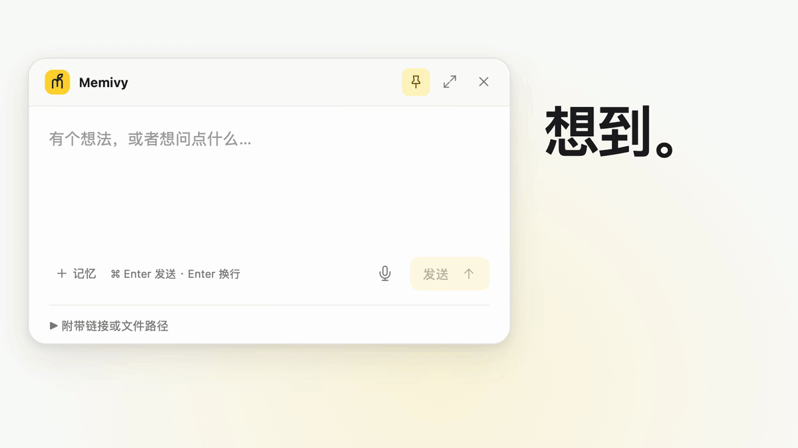
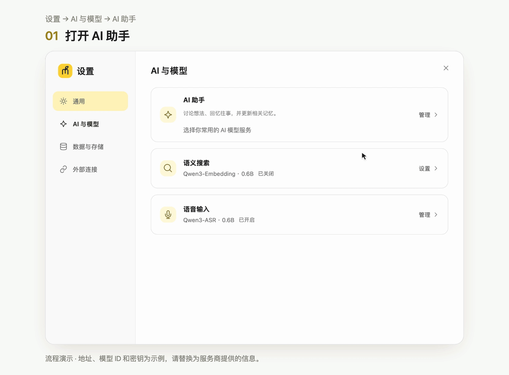
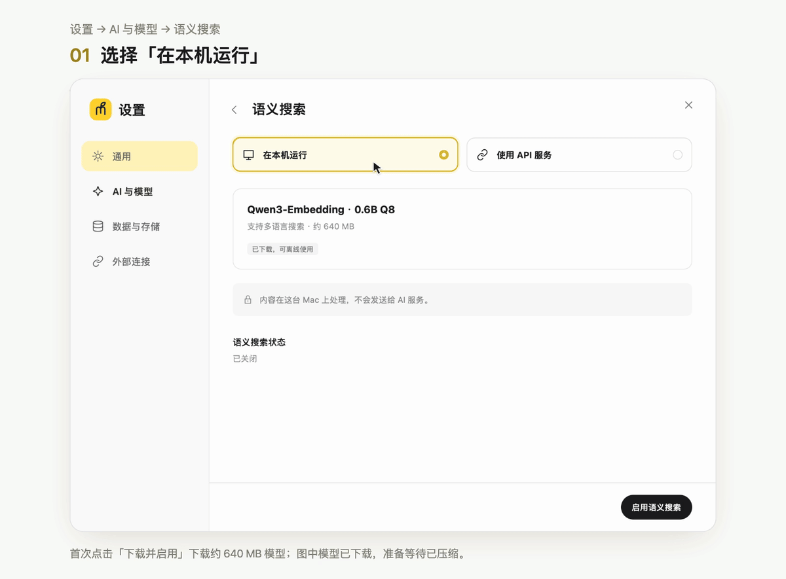
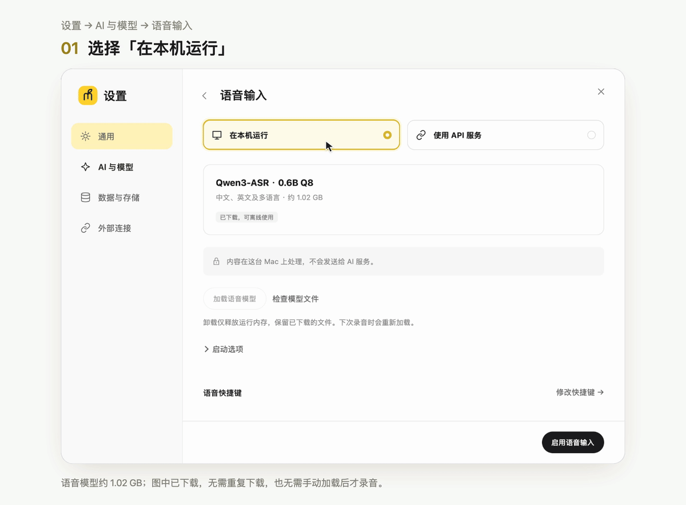
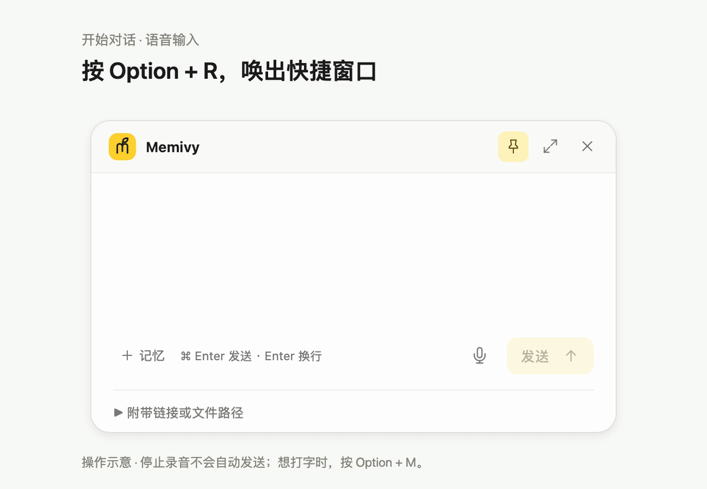
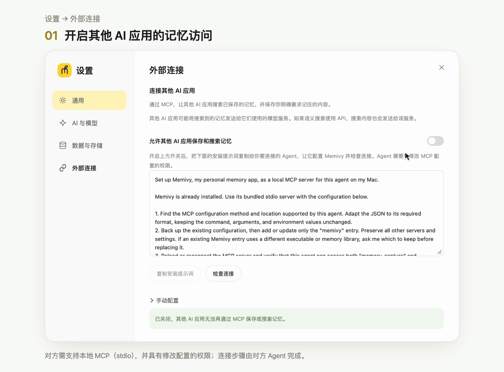

<p align="center">
  <strong>简体中文</strong> · <a href="README.md">English</a>
</p>

<p align="center">
  <a href="https://github.com/boh5/memivy/releases/latest">下载 Memivy</a> ·
  <a href="#开始使用">安装与使用</a> ·
  <a href="docs/media/zh/memivy.mp4">观看视频</a>
</p>

# Memivy，你的个人 AI 记忆助手

按下快捷键，说话或打字，Memivy 会帮你记下想法、整理记忆。以后想回顾，直接问它，也可以接着上次的话题继续聊。

## 特点

- **一键开聊**：按下快捷键，说话或打字，随时记下想法。
- **聊过的事，接着聊**：Memivy 会结合过去的记忆和你讨论，也会记下你的新想法和变化。
- **记不清原话，也能找**：用自己的话描述，找回相关的想法和记录。
- **自由选择模型（BYOM）**：接入你常用的 AI 模型服务，换模型也能继续使用同一份记忆。
- **记忆保存在本机**：记忆和对话保存在你的 Mac 上，无需注册 Memivy 账号。
- **让其他 AI 也用上你的记忆**：通过 MCP，让其他 AI 助手查找和保存 Memivy 中的记忆。

## 开始使用

需要 **Apple Silicon（M 系列芯片）的 Mac，运行 macOS 26 或更新版本**。

### 1. 安装

1. 从 [Releases](https://github.com/boh5/memivy/releases/latest) 下载最新版本的 DMG。
2. 打开 DMG，把 Memivy 拖入“应用程序”。
3. 推出磁盘映像，从“应用程序”打开 Memivy。

Memivy 尚未经过 Apple 公证。如果首次打开时提示无法验证开发者或无法检查恶意软件，请打开 **系统设置 → 隐私与安全性**，找到 Memivy 的提示，点击 **仍要打开**，再按提示确认。具体界面见 [Apple 的说明](https://support.apple.com/zh-cn/102445)。

<details>
<summary>校验下载文件（可选）</summary>

下载 DMG 对应的 `.sha256` 文件，放在同一文件夹中。在终端进入该文件夹后运行：

```sh
shasum -a 256 -c Memivy_*.dmg.sha256
```

显示 `OK` 表示文件校验通过。

</details>

### 2. 配置 AI 助手

准备好你常用的模型服务商提供的 API 地址、模型 ID 和 API Key。请选择支持工具调用的模型，Memivy 需要用它来查找和整理记忆。



1. 打开 **设置 → AI 与模型 → AI 助手**。
2. 按服务商的说明选择服务协议：**OpenAI 兼容**、**OpenAI Responses**、**Anthropic** 或 **Google Gemini**。
3. 填入服务商提供的 **API 地址**、**模型 ID** 和 **API Key**。
4. 点击 **测试连接**，通过后点击 **保存设置**。

API 用量和费用由你接入的服务商结算。

### 3. 开启本地搜索和语音

回到 **设置 → AI 与模型**，启用下面两项本地功能。首次下载时保持 Memivy 打开；下载后，两项功能都在你的 Mac 上运行。

#### 语义搜索

用自己的话找回记忆，不必记住原文中的关键词。首次使用需下载约 640 MB 的模型；动图展示模型已下载后的启用步骤。



1. 打开 **语义搜索**，选择 **在本机运行**。
2. 点击 **下载并启用**，再点击 **确认并开始**。
3. 等待模型下载和搜索准备完成。

#### 语音输入

说出想法，转成文字后再发送。首次使用需下载约 1.02 GB 的模型；动图展示模型已下载后的启用步骤。



1. 打开 **语音输入**，选择 **在本机运行**。
2. 点击 **下载模型**，等待下载完成。
3. 点击 **启用语音输入**。

### 4. 开始对话

以下演示使用语音输入。首次录音时，请允许 Memivy 访问麦克风。



1. 按默认语音快捷键 **Option+R**，唤出快捷窗口并开始录音，直接说出想法。
2. 再按一次 **Option+R** 结束录音，等待转写完成。
3. 确认文字后，按 **Command+Enter** 发送。

想打字时，可以按 **Option+M** 打开快捷窗口，**Enter** 用来换行，**Command+Enter** 发送。

想回顾时，同样按 **Option+R**，直接说出想问的问题。描述你还记得的内容就好，不用先翻出原来的对话。

## 连接其他 AI 应用

通过 MCP，你的其他 AI 助手也能保存和查找 Memivy 中的记忆。对方需要支持本地 MCP 服务（stdio），并有修改配置的权限。



1. 打开 **设置 → 外部连接**，开启 **允许其他 AI 应用保存和搜索记忆**。
2. 点击 **复制安装提示词**，直接发给你要连接的 AI 助手。提示词中已包含这台 Mac 上的 Memivy 连接配置。
3. 让它按提示添加 MCP 配置并检查连接。如果需要重启应用或补充权限，按它给出的步骤完成即可。

也可以展开 **手动配置**，自行添加连接。如果之后移动了 Memivy 的安装位置，重新复制提示词，让 AI 助手更新配置。

想停止访问时，在 Memivy 的 **外部连接** 中关闭开关。

## 备份、更新与卸载

资料库和设置位于 `~/Library/Application Support/com.memivy.app/`，下载的模型位于 `~/Library/Caches/com.memivy.app/models/`。

<details>
<summary>备份与恢复</summary>

在 **设置 → 数据与存储** 中点击 **创建备份**。备份包含记忆、对话、草稿、原始内容、历史版本和回收站，不包含 API Key、模型设置、下载的模型或临时录音。

恢复时点击 **选择备份**，核对内容后确认。Memivy 会先备份当前资料库，再用选中的备份替换它并重启；模型设置和 MCP 开关保留当前值。

</details>

<details>
<summary>更新</summary>

1. 在 **设置 → 数据与存储** 中创建备份。
2. 退出 Memivy；如果已连接其他 AI 应用，也先断开它们与 Memivy 的 MCP 连接。
3. 下载新版 DMG，用其中的 Memivy 替换“应用程序”里的旧版本。
4. 重新打开 Memivy，确认记忆和草稿正常，再恢复 MCP 连接。

Memivy 目前需要手动更新。请保留更新前的备份，旧版本可能无法打开新版更新过的资料库。

</details>

<details>
<summary>卸载</summary>

先关闭 MCP 访问并从其他 AI 应用中移除 Memivy 的配置，再退出 Memivy，将“应用程序”里的 Memivy 移到废纸篓。

卸载应用会保留资料库、设置和下载的模型。如果也要删除这些数据，请先备份，再移除上面列出的两个文件夹。模型缓存由正式版和 Memivy Dev 共用；保存在其他位置的备份需要另行处理。

</details>

## 从源码运行

开发环境、启动命令和测试方法都在[贡献指南](CONTRIBUTING.md#run-the-app-locally)中。
开发版使用独立的资料库，可以和正式版同时安装。

## 反馈与贡献

- 问题与建议：[提交 Issue](https://github.com/boh5/memivy/issues/new/choose)。
- 参与开发、文档或翻译：提交 PR 前请阅读[贡献指南](CONTRIBUTING.md)。
- 安全问题：[私密报告](SECURITY.md)。

## 许可证

[MIT](LICENSE)
